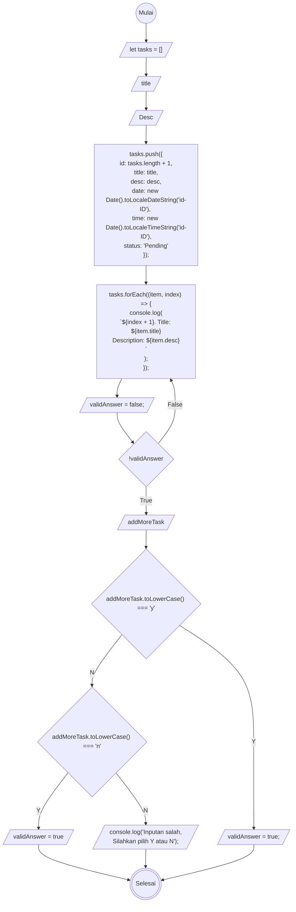

# Flowchart addTask

```mermaid
flowchart TD
START@{shape: circ, label: "Mulai"}
STOP@{shape: dbl-circ, label: "Selesai"}


TASK@{shape: lean-r, label: "let tasks = []"}
TITLE@{shape: lean-r, label: "title"}
DESC@{shape: lean-r, label: "Desc"}

TASKPUSH@{shape: rect, label: "tasks.push({
    id: tasks.length + 1,
    title: title,
    desc: desc,
    date: new Date().toLocaleDateString('id-ID'), 
    time: new Date().toLocaleTimeString('id-ID'),
    status: 'Pending'
  });"}

  TASKFOR@{shape: rect, label: "tasks.forEach((item, index) => {
    console.log(
      `${index + 1}. Title: ${item.title}\n Description: ${item.desc}\n\n`
    );
  });"}

  VALID@{shape: lean-r, label: "validAnswer = false;"}
  DECISION@{shape: diam, label: "!validAnswer"}

  ADD@{shape: lean-r, label: "addMoreTask "}

  DECISION2@{shape: diam, label: "addMoreTask.toLowerCase() === 'y'"}
  Y@{shape: lean-r, label: "validAnswer = true;"}
  N@{shape: diam, label: "addMoreTask.toLowerCase() === 'n'"}

  VALID2@{shape: lean-r, label: "validAnswer = true"}
  N2@{shape: lean-r, label: " console.log('Inputan salah, Silahkan pilih Y atau N');"}


START-->TASK
TASK-->TITLE
TITLE-->DESC
DESC-->TASKPUSH
TASKPUSH-->TASKFOR
TASKFOR-->VALID
VALID-->DECISION


DECISION--False-->TASKFOR
DECISION--True-->ADD


ADD-->DECISION2
DECISION2--Y-->Y
DECISION2--N-->N

N--Y-->VALID2
N--N-->N2

VALID2-->STOP
N2-->STOP
Y-->STOP


```