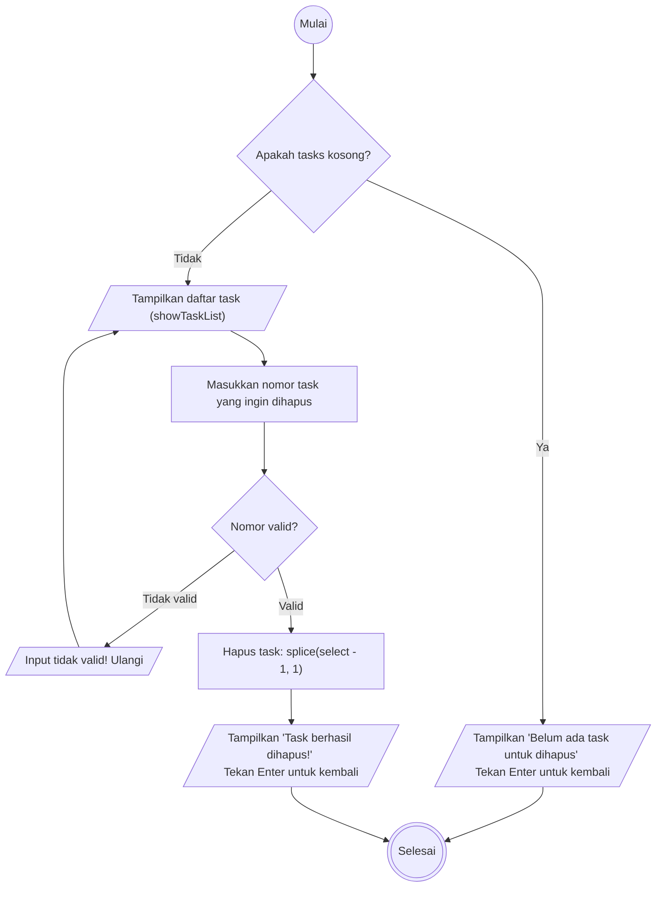

# Flowchart deleteTask

```mermaid
flowchart TD

START@{shape: circ, label: "Mulai"}
STOP@{shape: dbl-circ, label: "Selesai"}

CHECK-TASK@{shape: diam, label: "Apakah tasks kosong?"}
NO-TASK@{shape: lean-r, label: "Tampilkan 'Belum ada task untuk dihapus' \n Tekan Enter untuk kembali"}
SHOW-TASK@{shape: lean-r, label: "Tampilkan daftar task (showTaskList)"}

INPUT@{shape: rect, label: "Masukkan nomor task yang ingin dihapus"}
DECISION@{shape: diam, label: "Nomor valid?"}
INVALID@{shape: lean-r, label: "Input tidak valid! Ulangi"}
REMOVE@{shape: rect, label: "Hapus task: splice(select - 1, 1)"}
SUCCESS@{shape: lean-r, label: "Tampilkan 'Task berhasil dihapus!' \n Tekan Enter untuk kembali"}

START --> CHECK-TASK
CHECK-TASK --Ya--> NO-TASK --> STOP
CHECK-TASK --Tidak--> SHOW-TASK --> INPUT --> DECISION

DECISION --Tidak valid--> INVALID --> SHOW-TASK
DECISION --Valid--> REMOVE --> SUCCESS --> STOP


```