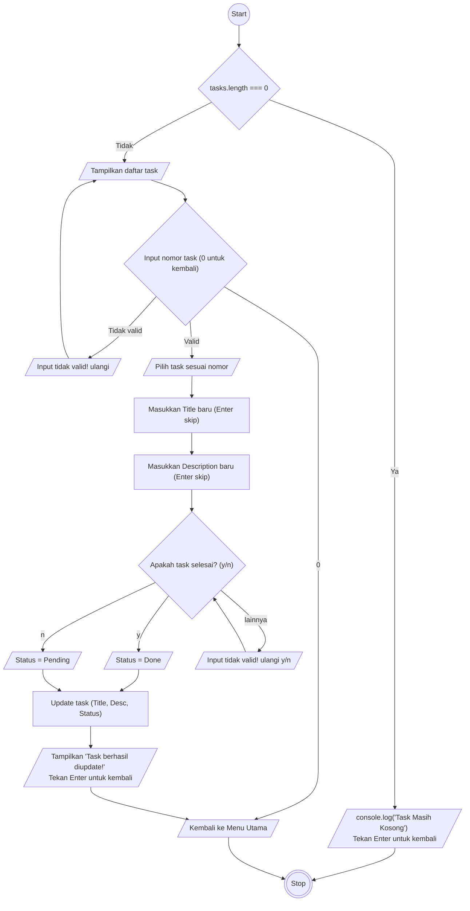

# Flowchart editTask

```mermaid
flowchart TD
START@{shape: circ, label: "Start"}
STOP@{shape: dbl-circ, label: "Stop"}

DECISION1@{shape: diam, label: "tasks.length === 0"}
Y@{shape: lean-r, label: "console.log('Task Masih Kosong') \n Tekan Enter untuk kembali"}
N@{shape: lean-r, label: "Tampilkan daftar task"}

DECISION2@{shape: diam, label: "Input nomor task (0 untuk kembali)"}
INVALID_INPUT@{shape: lean-r, label: "Input tidak valid! ulangi"}
BACK@{shape: lean-r, label: "Kembali ke Menu Utama"}
SELECT@{shape: lean-r, label: "Pilih task sesuai nomor"}

TITLE@{shape: rect, label: "Masukkan Title baru (Enter skip)"}
DESC@{shape: rect, label: "Masukkan Description baru (Enter skip)"}

DECISION3@{shape: diam, label: "Apakah task selesai? (y/n)"}
DONE@{shape: lean-r, label: "Status = Done"}
PENDING@{shape: lean-r, label: "Status = Pending"}
INVALID_STATUS@{shape: lean-r, label: "Input tidak valid! ulangi y/n"}

UPDATE@{shape: rect, label: "Update task (Title, Desc, Status)"}
SUCCESS@{shape: lean-r, label: "Tampilkan 'Task berhasil diupdate!' \n Tekan Enter untuk kembali"}

START-->DECISION1
DECISION1--Ya-->Y -->STOP
DECISION1 --Tidak--> N --> DECISION2

DECISION2 --0--> BACK 
DECISION2 --Tidak valid--> INVALID_INPUT --> N
DECISION2 --Valid--> SELECT --> TITLE --> DESC --> DECISION3

DECISION3 --y--> DONE --> UPDATE
DECISION3 --n--> PENDING --> UPDATE --> SUCCESS --> BACK --> STOP
DECISION3 --lainnya--> INVALID_STATUS --> DECISION3


```