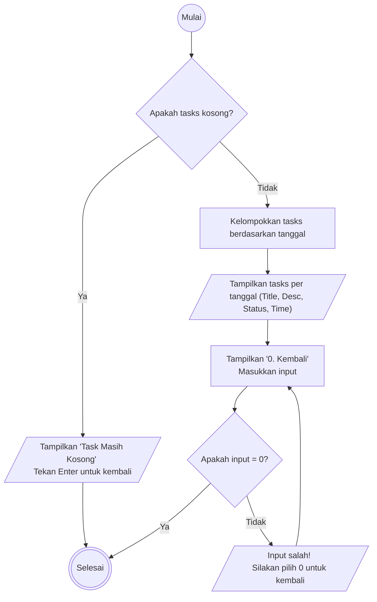

# FlowChart showTask

```mermaid
flowchart TD
START@{shape: circ, label: "Mulai"}
STOP@{shape: dbl-circ, label: "Selesai"}

CHECK-TASK@{shape: diam, label: "Apakah tasks kosong?"}
NO-TASK@{shape: lean-r, label: "Tampilkan 'Task Masih Kosong' \n Tekan Enter untuk kembali"}
GROUP-TASK@{shape: rect, label: "Kelompokkan tasks berdasarkan tanggal"}
SHOW-TASK@{shape: lean-r, label: "Tampilkan tasks per tanggal (Title, Desc, Status, Time)"}

INPUT@{shape: rect, label: "Tampilkan '0. Kembali' \n Masukkan input"}
DECISION@{shape: diam, label: "Apakah input = 0?"}
INVALID@{shape: lean-r, label: "Input salah! \n Silakan pilih 0 untuk kembali"}

START --> CHECK-TASK
CHECK-TASK --Ya--> NO-TASK --> STOP
CHECK-TASK --Tidak--> GROUP-TASK --> SHOW-TASK --> INPUT --> DECISION

DECISION --Tidak--> INVALID --> INPUT
DECISION --Ya--> STOP


```