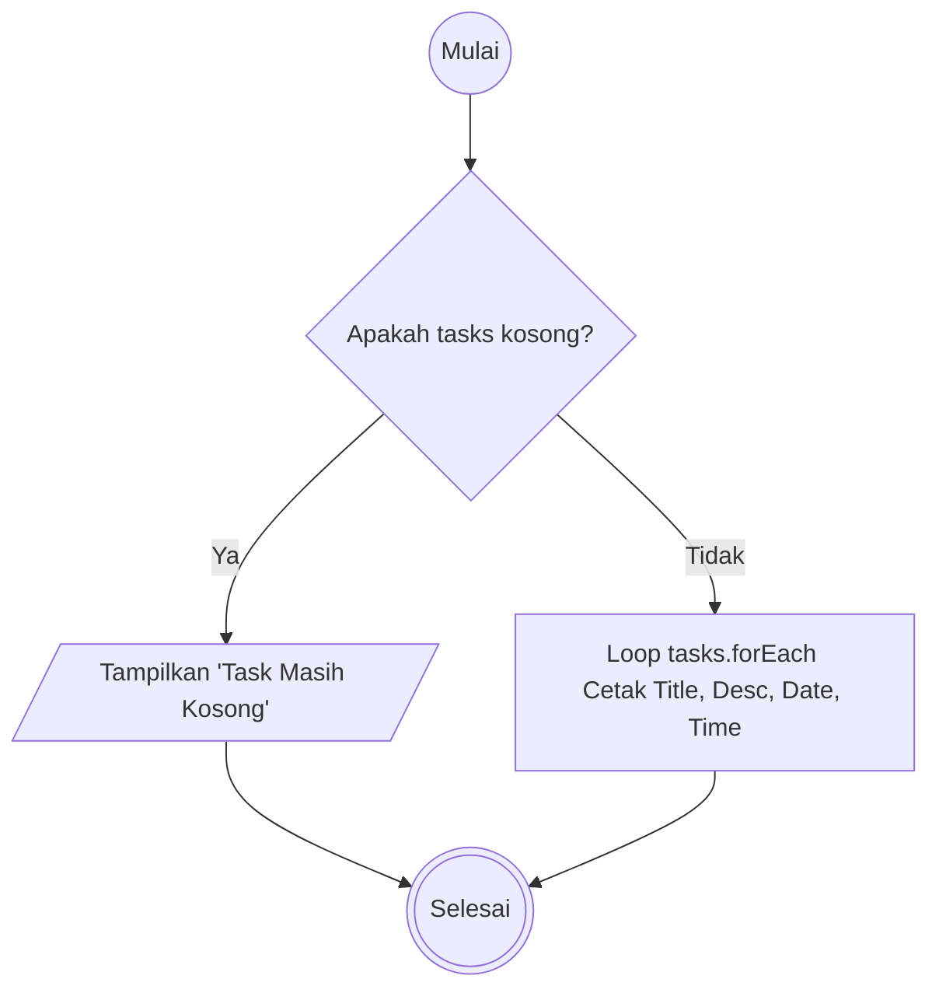

# Flowchart showTaskList

```mermaid
flowchart TD
START@{shape: circ, label: "Mulai"}
STOP@{shape: dbl-circ, label: "Selesai"}

CHECK-TASK@{shape: diam, label: "Apakah tasks kosong?"}
NO-TASK@{shape: lean-r, label: "Tampilkan 'Task Masih Kosong'"}
SHOW-LIST@{shape: rect, label: "Loop tasks.forEach \n Cetak Title, Desc, Date, Time"}

START --> CHECK-TASK
CHECK-TASK --Ya--> NO-TASK --> STOP
CHECK-TASK --Tidak--> SHOW-LIST --> STOP


```